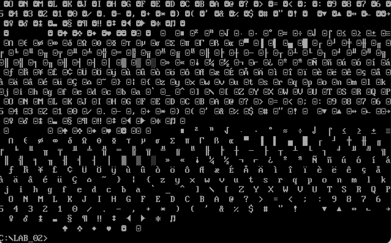

# Некоторые сведения

В представленном коде метка `DispMsg` используется как начальная точка выполнения программы. В ассемблерных программах метки служат для обозначения адресов в коде, к которым можно обращаться. Когда вы пишете `END DispMsg`, вы указываете компилятору, что выполнение программы должно начинаться с адреса, обозначенного меткой `DispMsg`.

Теперь давайте подробнее разберем вопросы:

### Почему возникает ошибка при удалении метки `DispMsg`?

Метка `DispMsg` используется в директиве `END DispMsg`. Эта директива сообщает ассемблеру, с какой точки начинать выполнение программы. Если убрать метку, ассемблер не будет знать, откуда начинать выполнение, что вызовет ошибку компиляции.

### Почему начало метки идет после начала сегмента, а конец метки - после конца сегмента?

В вашем коде:

- Сегмент данных `DataS` содержит данные программы.
- Сегмент кода `Code` содержит инструкции, которые должны выполняться.

Когда вы указываете метку `DispMsg` внутри сегмента `Code`, это просто означает, что выполнение кода начинается с этой метки. Это не противоречит началу и концу сегментов, потому что:

1. **Начало метки после начала сегмента**: Сначала задается сегмент кода `Code`, затем метка `DispMsg` внутри этого сегмента. Это логично, так как метка указывает конкретное место внутри уже определенного сегмента.

2. **Конец метки после конца сегмента**: Директива `END DispMsg` идет после закрывающей директивы сегмента `Code ENDS`, чтобы указать конец всего кода программы и начать выполнение с `DispMsg`.

Эта последовательность и "наслоение" нужны для того, чтобы:

- Сначала объявить все сегменты (данных и кода).
- Затем внутри сегментов определить данные и код.
- В конце указать точку входа в программу.

Таким образом, структура кода выглядит логично с точки зрения организации данных и кода и указания точки начала выполнения.

### Обобщение

Вот почему такая структура кода необходима и почему `DispMsg` так важна:

- Метка `DispMsg` указывает на начальную точку выполнения.
- Ассемблер требует этой информации для правильной генерации исполняемого файла.
- Структура сегментов и меток соответствует логике и требованиям ассемблерного кода, обеспечивая корректное выполнение программы.

### Зачем нужна директива `ASSUME`?

Директива `ASSUME` в ассемблере MASM (Microsoft Macro Assembler) используется для того, чтобы указать ассемблеру, какие сегменты будут использоваться определенными сегментными регистрами.
Эта директива помогает ассемблеру при проверке кода на предмет корректности использования сегментов.
В частности, `ASSUME` сообщает ассемблеру, какой сегмент соответствует регистру `CS` (Code Segment) и какой сегмент соответствует регистру `DS` (Data Segment).

Вот для чего нужна директива `ASSUME`:

1. **Помощь ассемблеру**: `ASSUME CS:Code, DS:DataS` говорит ассемблеру, что сегмент кода (CS) это `Code`, а сегмент данных (DS) это `DataS`. Это позволяет ассемблеру генерировать более точные сообщения об ошибках и предупреждениях во время сборки.
2. **Улучшение читаемости и понимания кода**: Человек, читающий код, сразу видит, какие сегменты используются и как они соответствуют сегментным регистрам.
3. **Соответствие стандартам**: В больших программах и проектах, где задействовано много сегментов, директива `ASSUME` помогает управлять соответствием регистров сегментам и избегать ошибок.

### Почему удаление `ASSUME` не вызывает ошибок?

Удаление директивы `ASSUME` не приводит к ошибкам компиляции, потому что ассемблер все равно корректно сгенерирует код. Директива `ASSUME` предназначена в основном для проверки кода во время компиляции, а не для непосредственного исполнения программы. Это значит, что даже без `ASSUME` ваш код будет компилироваться и выполняться, но вы потеряете те преимущества, которые она предоставляет.

### Важность настройки сегментного регистра `DS`

Настройка регистра `DS` с помощью `mov AX, DataS` и `mov DS, AX` крайне важна, так как без этого команда `mov DX, OFFSET HelloMessage` будет работать некорректно. Регистры `DS:DX` должны указывать на правильный сегмент и смещение, чтобы функция DOS могла корректно обработать строку. Если не загрузить адрес сегмента данных в `DS`, то команды, использующие сегментный регистр `DS`, могут обращаться к неправильным данным, что приведет к некорректному результату или даже к сбоям программы.

### Резюме

- **Директива `ASSUME`**: Упрощает проверку кода ассемблером и делает код более читаемым и поддерживаемым.
- **Настройка регистра `DS`**: Крайне важна для корректного выполнения кода, поскольку определяет правильный сегмент данных для последующих команд.

Таким образом, хотя директива `ASSUME` не обязательна для компиляции и выполнения программы, она полезна для разработки и отладки кода, тогда как настройка регистра `DS` обязательна для корректного выполнения программы.

# Вопросы

## Как работает loop? Что будет, если перед циклом через loop в cx 0 записать? Какие значения конкретно будут в cx во время такого цикла и почему?

Инструкция `loop` в ассемблере MASM используется для создания циклов, управляемых значением регистра `cx`. Синтаксис команды `loop` выглядит следующим образом:

```asm
loop метка
```

При выполнении команды `loop` происходит следующее:

1. Регистр `cx` уменьшается на 1.
2. Если после уменьшения значение `cx` не равно 0, выполнение переходит к указанной метке.
3. Если значение `cx` равно 0, выполнение продолжается со следующей инструкции после `loop`.

Теперь рассмотрим, что произойдет в следующем коде.

### Код:

```asm
mov dx, offset HelloMessage  ; DS:DX - адрес строки
mov ah, 09h  ; выдать на дисплей строку
mov cx, 0  ; что будет, если так сделать?
label1:
    int 21h  ; вызов функции DOS
    loop label1
```

### Анализ кода:

1. **Инициализация**:
    - `mov dx, offset HelloMessage` — устанавливает регистр `dx` на адрес строки `HelloMessage`.
    - `mov ah, 09h` — устанавливает регистр `ah` на значение 09h, что означает вызов DOS функции для вывода строки.
    - `mov cx, 0` — устанавливает регистр `cx` на 0.

2. **Начало цикла**:
    - Метка `label1` обозначает начало цикла.

3. **Инструкция `int 21h`**:
    - Выполняет DOS-инструкцию 21h (в данном случае вывод строки на экран).

4. **Инструкция `loop label1`**:
    - Уменьшает значение регистра `cx` на 1. Так как `cx` было установлено в 0, после уменьшения оно станет `FFFFh` (так как регистр `cx` 16-битный и уменьшение от 0 приводит к переполнению и установке максимального значения 16-битного регистра, т.е. `65535`).
    - Проверяется, равно ли `cx` 0. Поскольку `cx` теперь `FFFFh`, условие не выполнено, и выполнение переходит к метке `label1`.

### Почему цикл бесконечный:

- **Первоначальное значение `cx` = 0**:
    - `loop` уменьшает `cx` с 0 до `FFFFh`.
- **На следующем цикле**:
    - `loop` уменьшает `cx` с `FFFFh` до `FFFEh`.
    - И так далее...

Поскольку `cx` стало `FFFFh`, оно никогда не достигнет 0, поскольку каждое уменьшение будет проходить через все возможные значения 16-битного регистра, что составляет `65536` итераций (от `FFFFh` до 1). Таким образом, после каждой итерации `cx` не станет равным 0, и инструкция `loop` будет бесконечно возвращаться к метке `label1`.

### Значения `cx` во время цикла:

- После первой итерации: `cx = FFFFh`
- После второй итерации: `cx = FFFEh`
- После третьей итерации: `cx = FFFDh`
- И так далее...

Таким образом, каждый раз значение `cx` будет уменьшаться на 1, но никогда не достигнет 0, и цикл станет бесконечным.

### Проверка на тестовом коде

При запуске приведенного ниже кода можно увидеть, что перебираются все значения cx от FFFFh до 0000h, после чего программа завершается.
Т.е. цикл не бесконечный.

**Код:**

```asm
mov cx, 0
label1:
    mov dl, ch
    call print_sym

    mov dl, cl
    call print_sym

    call print_sep

    loop label1

mov ax, 4C00h
int 21h
```

**Результат:**


