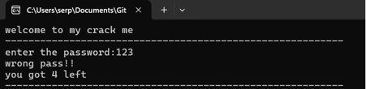
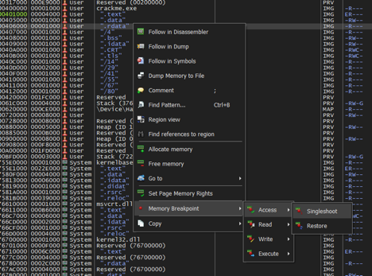
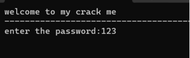
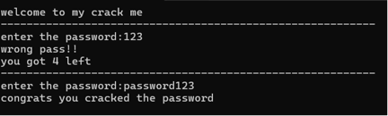

# Отчет по реверс-инжинирингу программы crackme.exe

## Введение

Реверс-инжиниринг программного обеспечения — это процесс анализа бинарного кода для понимания его структуры, логики и
работы. Одним из популярных инструментов для реверс-инжиниринга является x64dbg (и его версия для 32-битных программ —
x32dbg). В этом отчете будет рассмотрен процесс нахождения пароля, необходимого для получения сообщения "congrats you
cracked the password" в программе crackme.exe, с использованием x32dbg.

## Шаги решения задачи

### 1. Запуск программы и наблюдение за ее поведением

   Первоначально мы запускаем программу crackme.exe и наблюдаем за ее поведением.

   

   На данном этапе становится понятно, что в программе должно происходить сравнение введенной строки с правильной
   строкой (паролем).

### 2. Запуск программы через x32dbg

   Запускаем программу crackme.exe в отладчике x32dbg, чтобы найти место, где происходит сравнение пароля.

### 3. Поиск сравнения пароля

   Проходим по всем выставленным автоматически меткам в x32dbg. После ввода пароля, ставим метку на секции .rdata для
   отслеживания доступа.

   

### 4. Ввод произвольного пароля и анализ программы

   Вводим любой пароль для дальнейшего анализа.

   

   Затем с помощью шага с обходом (F8) продолжаем выполнение программы, отслеживая, где именно происходит сравнение
   введенного пароля с правильным.

### 5. Нахождение точки сравнения пароля

   Следим за выполнением программы, пока не находим инструкцию, где введенный пароль сравнивается с эталонным.

   

   Как видно на изображении, введенный нами пароль сравнивается со строкой "password123". Это и есть искомый пароль.

### 6. Проверка найденного пароля

   Вводим найденный пароль "password123" в программу для проверки.

   

   Программа выдает сообщение "congrats you cracked the password", что подтверждает правильность найденного пароля.

## Теоретические основы

**Реверс-инжиниринг:** Это процесс анализа компилированного программного обеспечения с целью получения высокого уровня
представления кода, который может включать структуру данных, алгоритмы, протоколы и т. д. Часто используется для поиска
уязвимостей, анализа вредоносного ПО или в учебных целях.

**Отладка (debugging):** Это процесс пошагового выполнения программы с целью анализа ее работы. Отладчик, такой как
x64dbg или x32dbg, позволяет разработчикам и исследователям просматривать и изменять память программы, регистры
процессора, устанавливать точки останова и выполнять другие действия, необходимые для анализа поведения программы.

**Секционные таблицы (.rdata):** Секции в бинарном файле, такие как .rdata, содержат различные данные, включая строковые
литералы и константы, которые используются программой. Отслеживание доступа к этим секциям помогает найти, где и как
программа использует эти данные.

## Заключение

Используя x32dbg, мы успешно нашли пароль "password123", необходимый для получения сообщения "congrats you cracked the
password" в программе crackme.exe. Этот процесс включал наблюдение за поведением программы, установку точек останова,
отслеживание доступа к памяти и анализ инструкций сравнения.

**Ответ:** password123.
